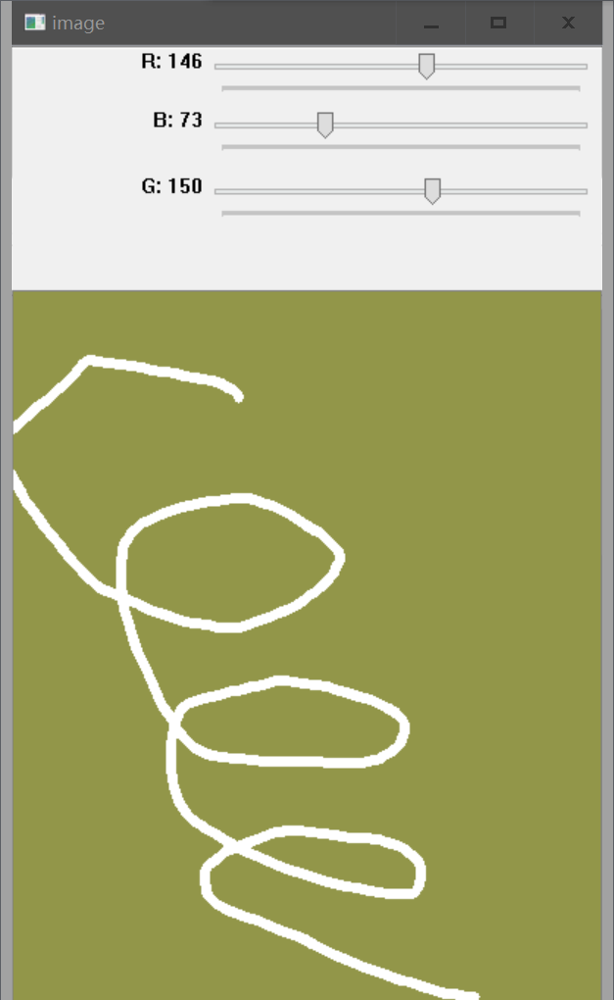

# OpenCV 培训

??? info "版本信息"
	Version 1.0.2 lastUpdateTime：2019-07-10 09:49  
	
	* 增加版本信息;
	* 增加中文搜索功能;
	* 更新简介;
	* 更新example 2 注释;
	* 修改example 3 关键词错误;

此资料主要用于培训期间常用`OpenCV`函数的快速上手。因时间精力有限，详细资料请查看：   


* [OpenCV Documentation](https://docs.opencv.org/4.1.0/) (Online,根据个人安装的版本查找对应的文档)

* [OpenCV-Python Tutorials](https://opencv-python-tutroals.readthedocs.io/en/latest/py_tutorials/py_tutorials.html) (Online,OpenCV-python官方教程)

* [OpenCV_Computer_Vision_with_Python](http://39.106.24.87:58000/OpenCV_Computer_Vision_with_Python.pdf) (PDF电子书,版本较老,对于新版本参考作用有限)

* [Python Code Examples](https://www.programcreek.com/python/) (Python 代码示例搜索. 输入‘cv2’,可检索opencv常见module的用例)

--- 

## 简介

* OpenCV是一个开源(BSD license)跨平台(Linux,Windows, OS_X,Android,IOS)计算机视觉库;
* 支持多种编程语言(C++,Java,Python,C#,Go);
* 支持各种常见图像处理,计算机视觉,机器学习算法以及应用;
* 底层由C,C++实现,轻量且高效;

OpenCV-Python是OpenCV的python api;

--- 

## 安装

* 方式一：在python安装目录的Scripts文件夹下,用pip或者conda工具安装。

```python
'''以下语句,根据需要选择一句执行即可'''
# 使用pip工具
pip install opencv-python
# 使用conda工具
conda install -c menpo opencv=3.4.0
conda install -c conda-forge opencv=3.4.0
# 使用pip安装指定版本opencv
pip install opencv-python==3.4.0
```

!!! 注意
	opencv3.0版本后的api接口分成了main module和extra module两部分,`pip install opencv-python`通常仅安装了main module. 部分功能如background extraction,optical flow,object tracking等因不在main module中无法使用,需要通过`pip install opencv-contrib-python`安装包含main module和extra module(具体那些功能属于main module与extra module,需要查看具体版本的OpenCV document)
	
	
* 方式二：通过wheel文件安装。
	* 下载对应平台与python版本的wheel文件，例如：<https://pypi.org/project/opencv-contrib-python/#files>；
	* 进入wheel文件下载目录,安装wheel文件
	```python
	# 进入wheel下载目录(假设C:\python35为文件下载目录)
	cd C:\python35
	# 文件安装
	pip install opencv_contrib_python-4.1.0.25-cp35-cp35m-win_amd64.whl
	```
* 测试

```python
import cv2
cv2.__version__
```


结果若如上图所示，则表明安装成功。

!!! 注意
	详细安装与使用方法以及常见问题解决方法可参考： <https://pypi.org/project/opencv-contrib-python/>

---
## 示例

本次培训包括以下示例内容：

* Example 1: 图像读写;
* Example 2: 视频读写;
* Example 3: 图像变换;
* Example 4: 图像分析;
* Example 5: 图像绘制;
* Example 6: GUI;

[所有代码示例文件打包下载](/2019_summer/opencv/example.zip)

---

### Example 1
```python
'''
Example 1：图像读入,显示,保存;
'''
import os
import cv2

os.chdir(os.path.dirname(__file__))

# 图像读入
image = cv2.imread("MyPic.png")
# 直接以灰度图形式载入图像
image_gray = cv2.imread("MyPic.png",cv2.IMREAD_GRAYSCALE)
# 不变
image_unchange = cv2.imread("MyPic.png",cv2.IMREAD_UNCHANGED)

# 建立图像显示窗口
cv2.namedWindow("display",cv2.WINDOW_NORMAL)
# 显示图像
cv2.imshow("display",image)
# 等待操作
cv2.waitKey()

# 图像保存
cv2.imwrite("MyPic.jpg",image)
```

1- 图像读入

```python
retval = cv2.imread(filename,flags)
```
flags常见设置：

| 序号 | 关键字 | 色彩空间 |
| :-- | :--: | :--: |
| 1 |IMAGE_COLOR | BGR |
| 2 |IMAGE_GRAYSCALE | 灰度 |
| 3 |IMAGE_UNCHANGED | 与原图相同 |

!!! 注意
	1. 文件中不要包含中文字符;
	2. OpenCV以B,G,R的顺序读入颜色通道, 与有些库以RGB读入的顺序不同(如Matplotlib). 不同库处理图像时,需要注意库对图像通道定义,若需要RGB颜色顺序,则需要对颜色空间进行变换.变换方法见 Example 3.


2- 图像显示

```python

cv2.namedWindow(winname,flags)	# 默认flags=CV_WINDOW_AUTOSIZE| CV_WINDOW_KEEPRATIO
cv2.imshow(winname,mat)			# 可通过Ctrl+C复制图像至剪贴板,通过Ctrl+S弹出保存对话框
cv2.waitKey(delay)				# delay为停顿毫秒数. 0表示等待用户操作.


```

namedWindow flags 常见设置

| 序号 | 关键字 | 属性 |
| :-- | :--: | :--: |
| 1 | WINDOW_NORMAL  | 窗口可调 |
| 2 |WINDOW_AUTOSIZE | 窗口自适应 |
| 3 |WINDOW_FREERATIO  | 不保持横纵比 |
| 4 |WINDOW_KEEPRATIO  | 保持横纵比 |


3- 图像保存

```
retval = cv2.imwrite(filename,image,flags)
```


!!! 提示
	也可以在显示图像的窗口中,通过键盘按下`Ctrl`+`S`,在弹出的文件保存对话框中输入保存文件的路径与名称保存.

---

### Example 2

```python
'''
Example 2: 视频读入与保存
'''
import os
import cv2

os.chdir(os.path.dirname(__file__))

# 视频读入
# 读入本地视频文件
cameraCapture = cv2.VideoCapture("MyVideo.mp4")
# 读入本地摄像机视频流
cameraCapture = cv2.VideoCapture(0)
# 读入网络视频流(RTSP协议)【大雄兔动画片-点播】
cameraCapture = cv2.VideoCapture("rtsp://184.72.239.149/vod/mp4://BigBuckBunny_175k.mov")
# 读入网络视频流(RTMP协议)【香港卫视-直播】
cameraCapture = cv2.VideoCapture("rtmp://live.hkstv.hk.lxdns.com/live/hks1")
# 读入网络视频流(HTTP协议)【CCTV1-直播】
cameraCapture = cv2.VideoCapture("http://223.110.242.130:6610/gitv/live1/G_CCTV-1-HQ/1.m3u8")
cv2.namedWindow("display",cv2.WINDOW_NORMAL)

#视频保存
fourcc = cv2.VideoWriter_fourcc('X','V','I','D')                    # 视频编码配置
videoWriter = cv2.VideoWriter('output.mp4', fourcc, 25, (480,320))  # 视频保存配置

# 连续播放视频帧图像
while True:
	# 从视频流中读取一帧图像
	success, frame = cameraCapture.read()
	if success:
		# 显示图像
		cv2.imshow("display",frame)
		# 将帧图像添加到视频保存序列中
		img = cv2.resize(frame,(480,320))	# 非必须
		videoWriter.write(img)
		# 交互
		if cv2.waitKey(1)==27:				# 按'ESC'键后退出程序
			break
	# 视频结束/读取错误后退出
	else:
		break
# 释放writer
videoWriter.release()
```

1- 视频读入

OpenCV可读入本地图片序列、视频文件、摄像头视频流以及网络视频流数据(如RTSP、RTMP、HTTP、UDP)

```python
# 返回一个对象
<VideoCapture object> =	cv2.VideoCapture()
<VideoCapture object> =	cv2.VideoCapture(filename)
<VideoCapture object> =	cv2.VideoCapture(url)
# 读入方法
success, frame = videoCaptureobject.read()	# 读入一帧图像
```
 
 
* success:	视频帧读入状态,
* frame:	视频帧图像

2- 视频保存


```python
# 编码设置
fourcc = cv2.VideoWriter_fourcc(c1, c2, c3, c4)
# 保存设置
<VideoWriter object> = cv2.VideoWriter(filename, fourcc, fps, frameSize)
```

c1,c2,c3,c4常见设置

| 序号 | 关键字 | 编码 |
| :-- | :--: | :--: |
| 1 |cv2.VideoWriter_fourcc('I','4','2','0') | YUV编码 |
| 2 |cv2.VideoWriter_fourcc('P','I','M','1') | MPEG-1编码 |
| 3 |cv2.VideoWriter_fourcc('X','V','I','D') | MPEG-4编码|  
| 4 |cv2.VideoWriter_fourcc('F','L','V','1') | Flash编码| 

---

### Example 3

```python
'''
Example 3: 图像变换
'''
import os
import cv2
import numpy as np

os.chdir(os.path.dirname(__file__))

# 图像读入
image = cv2.imread("MyPic.png")    # cv2.IMREAD_COLOR
# 色彩空间变换
image_gray = cv2.cvtColor(image,cv2.COLOR_BGR2GRAY)
# 尺度变换
image_scale = cv2.resize(image,(320,480))
# 位移
M1 = np.float32([[1,0,100],[0,1,50]])
image_mov = cv2.warpAffine(image,M1,(image.shape[1],image.shape[0]))
# 图像旋转
print(image.shape)
M2 = cv2.getRotationMatrix2D((960,540),10,1)
image_rot = cv2.warpAffine(image,M2,(image.shape[1],image.shape[0]))


# 图像显示
cv2.namedWindow("image",cv2.WINDOW_NORMAL)      # 窗口支持手动调整尺度
cv2.namedWindow("image_gray",cv2.WINDOW_NORMAL) # 窗口支持手动调整尺度
cv2.namedWindow("image_scale")  
cv2.namedWindow("image_mov",cv2.WINDOW_NORMAL)  
cv2.namedWindow("image_rot",cv2.WINDOW_NORMAL)


cv2.imshow("image",image)
cv2.imshow("image_gray",image_gray)
cv2.imshow("image_scale",image_scale)
cv2.imshow("image_mov",image_mov)
cv2.imshow("image_rot",image_rot)


cv2.waitKey()

```


Example 3 图像变换效果展示


1- 色彩空间变换

```python
dst	= cv2.cvtColor(src,flags)
```

cvtColor flags 常见设置

| 序号 | 关键字 | 属性 |
| :-- | :--: | :--: |
| 1 |COLOR_BGR2RGB | BGR顺序转RGB |
| 2 |COLOR_BGR2GRAY | 转为灰度图 |

---

2- 图像缩放

```python
dst	= cv2.resize(src, dsize, dst, fx, fy, interpolation)	#默认值:fx=0,fy=0,interpolation=cv2.INTER_LINEAR
```

`dsize`: 输出图像的尺寸(w,h)  

`fx` : 横轴尺度因子,如果`fx=0`,则 \(double(dsize.width/src.cols)\) 

`fy` : 纵轴尺度因子,如果`fy=0`,则 \(double(dsize.height/src.rows)\) 

resize interpolation 常见设置

| 序号 | 关键字 | 属性 |
| :-- | :--: | :--: |
| 1 |INTER_NEAREST | 邻近插值 |
| 2 |INTER_LINEAR | 双线性插值(效果一般,快)|
| 3 |INTER_CUBIC  | 双三次插值(效果好,慢) |

3- 仿射变换

仿射变换即保证线共点、点共线以及线间平行关系不变的几何变换。包括平移、缩放、剪切、旋转等效果。

```
dst	= cv2.warpAffine(src, M, dsize)

```

\[ [x',y',1] = [x,y,1]\times\left[\begin{matrix}M_{11}&M_{12}&M_{13}\\M_{21}&M_{22}&M_{23}\\0&0&1\end{matrix}\right]\]

$$ \left\{
\begin{aligned}
x'=M_{11}x+M_{12}y+M_{13} \\
y'=M_{21}x+M_{22}y+M_{23}
\end{aligned}
\right.
$$


变换矩阵常见设置

| 序号 | 变换矩阵 | 属性 |
| :-- | :--: | :-- |
| 1 |\(\left[\begin{matrix}1&0&0\\0&1&0\\0&0&1 \end{matrix}\right] \) | 不变 |
| 2 |\(\left[\begin{matrix}1&0&X\\0&1&Y\\0&0&1 \end{matrix}\right] \) | `x`方向平移X,`y`方向平移Y|
| 3 |\(\left[\begin{matrix}W&0&0\\0&H&0\\0&0&1 \end{matrix}\right] \) | `x`方向放大W倍,`y`方向放大H倍|
| 4 |\(\left[\begin{matrix}cos\theta&sin\theta&0\\-sin\theta&cos\theta&0\\0&0&1 \end{matrix}\right] \) | 以(0,0)为基点,顺时针旋转$\theta$|
| 5 |\(\left[\begin{matrix}1&0&0\\0&-1&0\\0&0&1 \end{matrix}\right] \) | 垂直翻转|
| 6 |\(\left[\begin{matrix}-1&0&0\\0&1&0\\0&0&1 \end{matrix}\right] \) | 水平翻转|

---

### Example 4

```python
'''
Example 4: 图像分析
'''
import os
import cv2
import numpy as np

os.chdir(os.path.dirname(__file__))

# 图像读入
image = cv2.imread("MyPic.png")    # cv2.IMREAD_COLOR
image_gray = cv2.cvtColor(image,cv2.COLOR_BGR2GRAY)

# 图像分割
ret, image_bw = cv2.threshold(image_gray, 127, 255, cv2.THRESH_BINARY)

# 边缘检测
image_canny = cv2.Canny(image_gray, 100, 300)

# Hough变换
minLineLength = 100
maxLineGap = 20
lines = cv2.HoughLinesP(image_canny, 1, np.pi / 180, 100, minLineLength, maxLineGap)
image_hough = image.copy()
for elem in lines:
    x1,y1,x2,y2 = elem[0]
    cv2.line(image_hough, (x1, y1), (x2, y2), (0, 255, 0), 5)
    
# 角点


# 图像显示
cv2.namedWindow("image",cv2.WINDOW_NORMAL)      # 窗口支持手动调整尺度
cv2.namedWindow("image_bw",cv2.WINDOW_NORMAL) # 窗口支持手动调整尺度
cv2.namedWindow("image_canny",cv2.WINDOW_NORMAL) # 窗口支持手动调整尺度
cv2.namedWindow("image_hough",cv2.WINDOW_NORMAL) # 窗口支持手动调整尺度

cv2.imshow("image",image)
cv2.imshow("image_bw",image_bw)
cv2.imshow("image_canny",image_canny)
cv2.imshow("image_hough",image_hough)

cv2.waitKey()
```


Example 4 图像分析效果展示


1- 图像分割 

图像分割就是提取图像感兴趣目标/区域的过程.
```
# 固定阈值二值化
ret, dst = cv2.threshold(src, thresh, maxval,flags)	#thresh为阈值,maxval当像素值超过了阈值时的设定值,flags为操作类型
```

threshold flags 常见设置

| 序号 | 关键字 | 属性 |
| :-- | :--: | :--: |
| 1 |THRESH_BINARY | src(x,y)>thresh,dst(x,y)=max_value,反之dst(x,y)=0 |
| 2 |THRESH_BINARY_INV | src(x,y)>thresh,dst(x,y)=0,反之dst(x,y)=max_value|
| 3 |THRESH_TRUNC | src(x,y)>thresh,dst(x,y)=max_value,反之dst(x,y)=src(x,y)|
| 4 |THRESH_TOZERO | src(x,y)>thresh,dst(x,y)=src(x,y),反之dst(x,y)=0 |
| 5 |THRESH_TOZERO_INV | src(x,y)>thesh,dst(x,y)=0,反之dst(x,y)=src(x,y) |

2- 边缘检测

边缘检测的目的是识别图像中亮度变化较为明显的点。
常见的方法有三种，`Sobel`算子(一阶微分算子)，`Laplacian`算子(二阶微分算子)，`Canny`算子。

Canny算子的计算步骤：

* 高斯滤波平滑；
	
	$$
	H_{ij}=\frac{1}{2\pi\sigma^2}exp(-\frac{(i-(k+1))^2+(j-(k+1))^2}{2\sigma^2});1\leq i,j\leq (2k+1)
	$$
	
	$$
	e = H*A
	$$

* 计算已阶偏导的幅值和方向；
	
	$$
	G = \sqrt{G_x^2+G_y^2} ,  
	\theta=arctan(\frac{G_y}{G_x})
	$$
	
	x,y 方向的Sobel算子
	
	$$
	S_x= \left[ \begin{matrix}1&2&1\\0&0&0\\-1&-2&-1\end{matrix} \right], S_y= \left[ \begin{matrix}-1&0&1\\-2&0&2\\-1&0&1\end{matrix} \right]
	$$
	
	$$
	G_x=S_x*A, G_y=S_y*A
	$$
	
	
	
* 对梯度幅值进行非最大值抑制； 

* 用双阈值算法检测和连接边缘. 


```python
edges =	cv2.Canny(image,threshold1, threshold2,apertureSize=3,L2gradient=false)
```

* threshold1：双阈值算法中的阈值1，低于阈值1的确定不是边缘；threshold2：双阈值算法中的阈值2，高于阈值2的确定是边缘。在阈值1与阈值2之间的像素点，若与确定边缘相接，则认为是边缘否则不是。

* apertureSize：Sobel算子的大小;

* L2gradient：L2范数计算梯度标识，若为True，则使用L2范数计算梯度，结果精度更高；否则使用L1范数计算梯度。
$L_2 norm = \sqrt{(\frac{dI}{dx})^2+(\frac{dI}{dy})^2}$；
$L_1 norm = |\frac{dI}{dx}|+|\frac{dI}{dy}|$


!!! 注意
	边缘检测基于灰度图进行计算，计算之前先将色彩空间转为灰度或以单色彩通道计算.


3- Hough变换

Hough变换是检测具有特定参数形状的方法。其原理为将形状参数在hough空间中进行投票，投票结果中的局部最大值即为所要提取形状的参数。

Hough变换最简单的应用就是检测直线。

斜截式：
$y = mx + b$，
则参数空间中的一个点(m,b)就可以表示一条直线；

Hesse法线式：
$r = xcos\theta+ysin\theta$，
图像中的每一条直线都与hough空间中的一个点$(r,\theta)$关联。


对于直线检测，OpenCV提供了两种Hough变换形式。其中，标准版本为`cv2.HoughLines`，输入为边缘图像，输出为`[float,float]`形式的`narray`，每个值表示一条检测直线的$(r,\theta)$. 概率Hough变换版本为`cv2.HoughLinesP`, 概率Hough变换为了解决像素偶然所造成的虚假检测，只检测分段直线而不是贯穿整个图像的直线。

```python
# 标准Hough变换
lines =	cv2.HoughLines(image, rho, theta, threshold, min_theta, max_theta)
```

* image:	边缘图像(二值图像);

* rho:		以像素为单位的距离精度;

* theta:	以弧度为单位的角度精度;

* threshold:Hough空间的累加阈值，超过阈值才被认为检测到直线;


```
# 概率Hough变换
lines =	cv.HoughLinesP(image, rho, theta, threshold, minLineLength, maxLineGap)

```


* image:	边缘图像(二值图像);

* rho:		以像素为单位的距离精度;

* theta:	以弧度为单位的角度精度;

* threshold:Hough空间的累加阈值，超过阈值才被认为检测到直线;

* minLineLength: 检出线段的最小长度阈值;

* maxLineGap:检出线段的最大间隔阈值,同一行点与点之间连接起来的最大的距离。;


---

### Example 5

```python
'''
Example 5: 图像绘制
'''
import os
import cv2
import numpy as np

os.chdir(os.path.dirname(__file__))


# 图像读入
image = cv2.imread("MyPic.png")    # cv2.IMREAD_COLOR
image_gray = cv2.cvtColor(image,cv2.COLOR_BGR2GRAY)

# 创建空图像
# image_process = np.zeros_like(image)
image_process = np.zeros((1080,1920,3),np.uint8)	# 图像为无符号8位数
# 图像赋值
image_process[980:1080,0:1920] = [0,0,255]
image_process[880:980,0:1920] = [0,255,0]
image_process[780:880,0:1920] = [255,0,0]
# 图像复制
image_process[480:780,0:1920] = image[480:780,0:1920]
# 图像数值判断
loc = np.where(image[:,:,2]>200)
image_process[loc] = [0,255,255]

# 图像绘制
# 绘制直线
cv2.line(image_process,(0,0),(100,100),(255,0,255),10)
cv2.line(image_process,(100,100),(0,100),(255,0,255),10)
# 绘制矩形
cv2.rectangle(image_process,(0,150),(100,200),(255,0,255),10)
# 绘制多边形
pts_1 = np.array([[300,150],[350,100],[400,100],[450,150],[400,200],[350,200]], np.int32)
cv2.polylines(image_process,[pts_1],True,(255,255,255),5)
# 填充多边形
pts_2 = np.array([[500,150],[550,100],[600,100],[650,150],[600,200],[550,200]], np.int32)
cv2.fillPoly(image_process,[pts_2],(128,0,255))
# 绘制圆形
cv2.circle(image_process,(200,100),100,(255,255,0),10)
# 绘制文字
cv2.putText(image_process, 'ABCDE_12345', (200,300),cv2.FONT_HERSHEY_SIMPLEX,3,(0,255,0),5)

# 图像显示
cv2.namedWindow("image",cv2.WINDOW_NORMAL)              # 窗口支持手动调整尺度
cv2.namedWindow("image_process",cv2.WINDOW_NORMAL)      # 窗口支持手动调整尺度

cv2.imshow("image",image)
cv2.imshow("image_process",image_process)


cv2.waitKey()
```


Example 5 图像绘制效果展示

图像绘制

```python
# 绘制直线
cv2.line(img,pt1,pt2,color,thickness)						# pt1为起点,pt2为终点
# 绘制矩形
cv2.rectangle(img,pt1,pt2,color,thickness)					# pt1为左上角,pt2为右下角
# 绘制圆形
cv2.circle(img,pt,radius,color,thickness)					# pt为圆点
# 添加文字
cv2.putText(img,str,pt,cv2.font,fontScale,color,thickness)	# pt为左上角坐标
# 绘制多边形
cv2.polylines(img,[pts],isClosed,color,thickness)			# [pts]为点集
# 填充多边形
cv2.fillPoly(img,[pts],color)								# [pts]为点集

```

* pt1,pt2:关键点位置,形式(x,y),类型tuple;

* color: 颜色,(v1,v2,v3)BGR三通道色彩值(0~255);

* thickness: 线条粗细;

* radius: 半径;

* font: 字体;

* fontScale: 字体大小;

* isClosed: 多边形是否闭合;

* [pts]: 关键点集合;


常见字体设置

| 序号 | 关键字 | 属性 |
| :-- | :--: | :--: |
| 1 |FONT_HERSHEY_SIMPLEX| 正常大小无衬线字体 |
| 2 |FONT_HERSHEY_PLAIN| 小号无衬线字体 |
| 3 |FONT_HERSHEY_COMPLEX| 正常大小有衬线字体|


!!! 注意
	1. cv2.line(),cv2.rectangle(),cv2.circle(),cv2.putText()输入点应为tuple类型;
	2. cv2.polylines(),cv2.fillPoly()输入点集应为numpy.array类型;
	3. cv2.putText()不直接支持中文,使用时尽量避免中文标注;
	4. 图像数据无法直接通过赋值进行复制，通过'='对变量进行赋值时，得到只是源数据的引用地址，对赋值后的变量进行操作时，同时也对源图像数据进行了修改。需要在源图像上进行进行一系列操作但不希望破坏原始数据时，需要对源数据进行赋值.
	```python
	img_add_cp = img	# 引用
	img_cp = img.copy()	# 复制
	```

---


### Example 6

```python
'''
Example 6: GUI
'''
import os
import cv2
import numpy as np

os.chdir(os.path.dirname(__file__))

# 创建画布图像和窗口
img = np.zeros((500, 400, 3), np.uint8)
cv2.namedWindow('image')

# 创建存放绘制点list
points = []

# 定义回调函数
# trackbar 无操作
def trackbar_event(object):
    pass

# 鼠标回调函数
def mouse_event(event,x,y,flags,param):
    global points
    if event == cv2.EVENT_LBUTTONDOWN:
        points = []
    if event == cv2.EVENT_LBUTTONUP:
        pass
    if event==cv2.EVENT_MOUSEMOVE and flags==cv2.EVENT_FLAG_LBUTTON:
        points.append((x,y))
        
# 创建三个开关滑动条RBG
cv2.createTrackbar('R', 'image', 0, 255, trackbar_event)
cv2.createTrackbar('B', 'image', 0, 255, trackbar_event)
cv2.createTrackbar('G', 'image', 0, 255, trackbar_event)

cv2.setMouseCallback("image",mouse_event)

while(True):
    r = cv2.getTrackbarPos('R', 'image')
    g = cv2.getTrackbarPos('G', 'image')
    b = cv2.getTrackbarPos('B', 'image')
    img[:] = [b, g, r]
    for i in range(len(points)-1):
        cv2.line(img,points[i],points[i+1],(255,255,255),5)
    if cv2.waitKey(10)==27: # ESC按键键码为27,即按ESC后退出
        break
    cv2.imshow('image', img)
cv2.destroyAllWindows()
```
  
  

Example 6 GUI示例效果展示

1- 回调函数 

回调函数即回头调用的函数，主函数执行完成后，在调用传进来的函数。当特定的事件或条件发生的时候，调用者使用函数指针调用回调函数对事件进行处理

常用鼠标响应事件

| 序号 | 关键字 | 属性 |
| :-- | :--: | :--: |
| 1 |EVENT_LBUTTONDOWN | 鼠标左击|
| 2 |EVENT_RBUTTONDOWN | 鼠标右击|
| 3 |EVENT_MOUSEMOVE | 鼠标移动|
| 4 |EVENT_LBUTTONUP | 左键释放|
| 5 |EVENT_RBUTTONUP | 右键释放|
| 6 |EVENT_LBUTTONDBLCLK | 左键双击|
| 7 |EVENT_RBUTTONDBLCLK | 右键双击|

